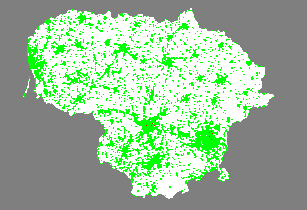

# Covid Grid Simulation

## About the Project

Simple simulation of a grid with people and a virus spreading. The simulation is similar to the [Conway's Game of Life](https://en.wikipedia.org/wiki/Conway%27s_Game_of_Life) but with a virus spreading.

## Generated Visual

## Tools Used in This Project

* [poetry](https://github.com/python-poetry/poetry): Python packaging and dependency management.
* [pre-commit plugins](https://pre-commit.com/): Automate code reviewing formatting.
* [black](https://pypi.org/project/black/): Python code formatter.
* [isort](https://pypi.org/project/isort/): Library to sort imports alphabetically.
* [ruff](https://github.com/astral-sh/ruff): An extremely fast Python linter (flake8 replacement).
* [mypy](https://mypy.readthedocs.io/en/stable/): Static type checker.

## Getting Started

1. Set up and install the environment: `$ make env`
2. (Optional) Install the git hook scripts: `$ make dependencies`
3. (Optional) Run all pre-commit hooks: `$ pre-commit run --all-files`

## Contact

[Marius Arlauskas](marius.arlauskas01.dev@gmail.com)
